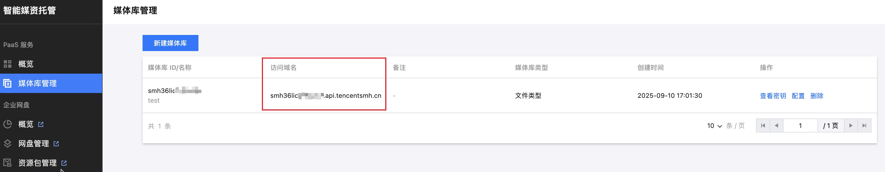

# 智能媒资托管 SMH MCP Server

基于 MCP 协议的SMH MCP Server，无需编码即可让大模型快速接入腾讯云智能媒资托管（SMH）能力。

## 核心功能

云端存储能力

- ⬆️ 文件上传到云端
- ⬇️ 文件从云端下载
- 🔄 云端文件删除 / 重命名 / 移动 / 复制
- 📦 批量删除 / 移动 / 复制
- 📂 列出目录内容
- 📁 创建目录
- ℹ️ 查看文件或目录详情
- 🔍 搜索文件和目录

## 环境要求

- Node.js **>= 18**
- 在 [腾讯云智能媒资托管控制台](https://console.cloud.tencent.com/smh/library) 创建媒体库：



## 快速开始

推荐通过 `npx` 在 MCP 客户端中直接运行，**无需手动安装**：

```bash
npx -y smh-mcp
```

也可以全局安装：

```bash
npm install -g smh-mcp
```

## 配置说明

服务通过环境变量读取配置（也支持本地 `.env` 文件）。

### 鉴权模式选择

本 MCP 支持两种鉴权模式，**优先级**：`SMH_LIBRARY_SECRET` > `SMH_ACCESS_TOKEN`，二者同时设置时只使用 `SMH_LIBRARY_SECRET`。

#### 模式 A：librarySecret 模式（推荐）

适用于将 MCP 部署在 **你完全可控的环境**（本地开发机、内网服务器等）。MCP 持有 `librarySecret`，可按需自动签发新 `accessToken`，**永不因长时间空闲而失效**。

> ⚠️ **安全须知**：`librarySecret` 是企业网盘的长期高敏感凭证，泄漏将导致整个媒体库被未授权访问。请确保：
>
> - 仅在你自己完全可控的机器上配置；
> - 不要提交到代码仓库、不要写入共享配置；
> - 不要在不受信任的第三方环境（如他人电脑、公共服务器）使用此模式。

#### 模式 B：accessToken 模式

适用于无法获取 `librarySecret`、或不希望将 `librarySecret` 放在当前环境的场景，例如使用管理员预先签发的临时 token。

> ⚠️ **限制**：MCP 长时间空闲后，token 会超过最大可续期窗口而失效，需重新获取 token 并重启 MCP，**不适合长期常驻服务**。

### 环境变量列表

| 环境变量 | 是否必填 | 默认值 | 说明 |
| --- | --- | --- | --- |
| `SMH_LIBRARY_ID`     | ✅ | — | SMH 媒体库 ID |
| `SMH_SPACE_ID`       | ✅ | — | 默认空间 ID |
| `SMH_LIBRARY_SECRET` | ⭕ 二选一 | — | 媒体库密钥（**推荐**，仅在可信环境使用） |
| `SMH_ACCESS_TOKEN`   | ⭕ 二选一 | — | 访问令牌（无 secret 时使用） |
| `SMH_BASE_PATH`      | ❌ | `https://api.tencentsmh.cn` | SMH API 接入点 |
| `SMH_USER_ID`        | ❌ | `mcp-user` | 任务关联的用户 ID |
| `MCP_TRANSPORT`      | ❌ | `stdio` | 传输模式：`stdio`（本地进程）/ `http`（Streamable HTTP） |
| `MCP_HTTP_PORT`      | ❌ | `3000` | HTTP 模式下监听端口 |


## 在 MCP 客户端中使用

### Cursor

打开 Cursor 设置 → MCP → 添加新的 MCP Server，写入以下配置：

推荐（librarySecret 模式）：

```json
{
  "mcpServers": {
    "smh": {
      "command": "npx",
      "args": ["-y", "smh-mcp"],
      "env": {
        "SMH_LIBRARY_SECRET": "你的媒体库密钥",
        "SMH_LIBRARY_ID": "你的媒体库 ID",
        "SMH_SPACE_ID": "你的空间 ID"
      }
    }
  }
}
```

或（accessToken 模式）：

```json
{
  "mcpServers": {
    "smh": {
      "command": "npx",
      "args": ["-y", "smh-mcp"],
      "env": {
        "SMH_ACCESS_TOKEN": "你的访问令牌",
        "SMH_LIBRARY_ID": "你的媒体库 ID",
        "SMH_SPACE_ID": "你的空间 ID"
      }
    }
  }
}
```

### Claude Desktop

编辑 Claude Desktop 的 MCP 配置文件：

- macOS：`~/Library/Application Support/Claude/claude_desktop_config.json`
- Windows：`%APPDATA%\Claude\claude_desktop_config.json`

```json
{
  "mcpServers": {
    "smh": {
      "command": "npx",
      "args": ["-y", "smh-mcp"],
      "env": {
        "SMH_BASE_PATH": "https://api.tencentsmh.cn",
        "SMH_ACCESS_TOKEN": "你的访问令牌",
        "SMH_LIBRARY_ID": "你的媒体库 ID",
        "SMH_SPACE_ID": "你的空间 ID",
        "SMH_USER_ID": "mcp-user"
      }
    }
  }
}
```

### Cline（VS Code 插件）

在 Cline 的 MCP 设置中添加：

```json
{
  "mcpServers": {
    "smh": {
      "command": "npx",
      "args": ["-y", "smh-mcp"],
      "env": {
        "SMH_ACCESS_TOKEN": "你的访问令牌",
        "SMH_LIBRARY_ID": "你的媒体库 ID",
        "SMH_SPACE_ID": "你的空间 ID"
      }
    }
  }
}
```

### 本地构建模式

如果你在本地源码构建后使用，可以将 `command` / `args` 替换为：

```json
{
  "command": "node",
  "args": ["/绝对路径/到/smh-mcp/dist/index.js"]
}
```

### Streamable HTTP 模式（远程部署）

当需要将 MCP Server 部署为远程 HTTP 服务时，设置 `MCP_TRANSPORT=http`：

```bash
# 启动 HTTP 模式
MCP_TRANSPORT=http MCP_HTTP_PORT=3000 npx smh-mcp
```

启动后，MCP 端点为 `http://localhost:3000/mcp`，健康检查端点为 `http://localhost:3000/health`。

客户端连接示例（以支持 Streamable HTTP 的 MCP 客户端为例）：

```json
{
  "mcpServers": {
    "smh": {
      "url": "http://your-server:3000/mcp"
    }
  }
}
```

## 工具列表

本 MCP Server 当前提供以下 12 个工具：

| 工具名称 | 功能简介 |
| --- | --- |
| `create_upload_task`      | 创建文件上传任务，支持分片、并发、秒传 |
| `create_download_task`    | 创建文件下载任务，支持分片、并发 |
| `create_directory`        | 创建目录，自动创建中间父目录 |
| `search_files`            | 搜索文件和目录，支持文件名搜索和全文搜索 |
| `rename_file`             | 重命名或移动 SMH 中的文件，支持冲突策略 |
| `copy_file`               | 复制 SMH 中的文件到新位置，原文件保持不变 |
| `move_file`               | 移动 SMH 中的文件到其他目录 |
| `list_directory`          | 列出目录内容，支持分页、排序、过滤 |
| `info_file_or_directory`  | 获取文件或目录的详细信息（大小、修改时间等） |
| `batch_delete`            | 批量删除多个文件或目录，支持混合永久删除和回收站 |
| `batch_move`              | 批量移动多个文件或目录到新位置 |
| `batch_copy`              | 批量复制多个文件或目录到新位置 |

### 1. `create_upload_task`（创建上传任务）

将本地文件上传到 SMH 指定路径，推荐用于上传大文件或需要监控进度的场景。

**入参：**

| 参数 | 类型 | 必填 | 默认值 | 说明 |
| --- | --- | --- | --- | --- |
| `localPath` | string | ✅ | — | 本地文件路径（绝对或相对路径） |
| `remotePath` | string | ✅ | — | SMH 中目标路径，如 `/folder/filename.ext` |
| `spaceId` | string | ❌ | 配置默认值 | 目标空间 ID |
| `chunkSize` | number | ❌ | `10` | 分片大小，单位 MB，范围 1-100 |
| `parallel` | number | ❌ | `3` | 并发上传数，范围 1-10 |
| `enableInstantUpload` | boolean | ❌ | `true` | 是否开启秒传 |

**调用示例：**

```json
{
  "localPath": "./large-file.txt",
  "remotePath": "/uploads/large-file.txt",
  "chunkSize": 10,
  "parallel": 3,
  "enableInstantUpload": true
}
```

### 2. `create_download_task`（创建下载任务）

将 SMH 中的文件下载到本地，推荐用于下载大文件或需要监控进度的场景。

**入参：**

| 参数 | 类型 | 必填 | 默认值 | 说明 |
| --- | --- | --- | --- | --- |
| `remotePath` | string | ✅ | — | SMH 文件路径，如 `/folder/filename.ext` |
| `localPath` | string | ✅ | — | 本地保存路径 |
| `spaceId` | string | ❌ | 配置默认值 | 文件所在空间 ID |
| `chunkSize` | number | ❌ | `10` | 分片大小，单位 MB，范围 1-100 |
| `parallel` | number | ❌ | `3` | 并发下载数，范围 1-10 |
| `overwrite` | boolean | ❌ | `false` | 本地文件已存在时是否覆盖 |

**调用示例：**

```json
{
  "remotePath": "/uploads/large-file.txt",
  "localPath": "./downloaded-file.txt",
  "chunkSize": 10,
  "parallel": 3,
  "overwrite": false
}
```

### 3. `rename_file`（重命名 / 移动文件）

对 SMH 中的文件进行重命名或移动到其他目录。

**入参：**

| 参数 | 类型 | 必填 | 默认值 | 说明 |
| --- | --- | --- | --- | --- |
| `sourcePath` | string | ✅ | — | 文件当前路径 |
| `destinationPath` | string | ✅ | — | 文件目标路径 |
| `spaceId` | string | ❌ | 配置默认值 | 文件所在空间 ID |
| `conflictResolutionStrategy` | string | ❌ | `rename` | 冲突策略：`rename`（自动重命名）/ `overwrite`（覆盖）/ `ask`（返回错误） |

**调用示例：**

```json
{
  "sourcePath": "/folder/oldname.txt",
  "destinationPath": "/folder/newname.txt",
  "conflictResolutionStrategy": "rename"
}
```

### 4. `copy_file`（复制文件）

复制 SMH 中的文件到新位置，原文件保持不变。

**入参：**

| 参数 | 类型 | 必填 | 默认值 | 说明 |
| --- | --- | --- | --- | --- |
| `sourcePath` | string | ✅ | — | 源文件路径 |
| `destinationPath` | string | ✅ | — | 目标路径 |
| `spaceId` | string | ❌ | 配置默认值 | 文件所在空间 ID |
| `conflictResolutionStrategy` | string | ❌ | `rename` | 冲突策略：`rename`（自动重命名）/ `overwrite`（覆盖）/ `ask`（返回错误） |

**调用示例：**

```json
{
  "sourcePath": "/docs/file.pdf",
  "destinationPath": "/backup/file.pdf",
  "conflictResolutionStrategy": "rename"
}
```

### 5. `move_file`（移动文件）

将 SMH 中的文件移动到其他目录，原位置文件将被移除。

**入参：**

| 参数 | 类型 | 必填 | 默认值 | 说明 |
| --- | --- | --- | --- | --- |
| `sourcePath` | string | ✅ | — | 文件当前路径 |
| `destinationPath` | string | ✅ | — | 文件目标路径 |
| `spaceId` | string | ❌ | 配置默认值 | 文件所在空间 ID |
| `conflictResolutionStrategy` | string | ❌ | `rename` | 冲突策略：`rename`（自动重命名）/ `overwrite`（覆盖）/ `ask`（返回错误） |

**调用示例：**

```json
{
  "sourcePath": "/docs/file.pdf",
  "destinationPath": "/archive/file.pdf",
  "conflictResolutionStrategy": "rename"
}
```

### 6. `list_directory`（列出目录内容）

列出 SMH 中某个目录下的文件和子目录，支持分页、排序和过滤。

**入参：**

| 参数 | 类型 | 必填 | 默认值 | 说明 |
| --- | --- | --- | --- | --- |
| `dirPath` | string | ❌ | `""` | 目录路径，留空或 `/` 表示根目录 |
| `spaceId` | string | ❌ | 配置默认值 | 空间 ID |
| `limit` | number | ❌ | `20` | 每页返回数量，范围 1-100 |
| `marker` | string | ❌ | — | 分页标记，来自上一次响应 |
| `orderBy` | string | ❌ | — | 排序字段：`name` / `modificationTime` / `size` |
| `orderByType` | string | ❌ | — | 排序方向：`asc`（升序）/ `desc`（降序） |
| `filter` | string | ❌ | — | 过滤类型：`onlyDir`（仅目录）/ `onlyFile`（仅文件） |

**调用示例：**

```json
{
  "dirPath": "/docs",
  "limit": 50,
  "orderBy": "modificationTime",
  "orderByType": "desc"
}
```

### 7. `info_file_or_directory`（查看文件/目录详情）

获取文件或目录的详细信息，包括大小、修改时间、类型等元数据。

**入参：**

| 参数 | 类型 | 必填 | 默认值 | 说明 |
| --- | --- | --- | --- | --- |
| `filePath` | string | ✅ | — | 文件或目录路径 |
| `spaceId` | string | ❌ | 配置默认值 | 空间 ID |

**调用示例：**

```json
{
  "filePath": "/docs/file.pdf"
}
```

### 8. `create_directory`（创建目录）

在 SMH 中创建新目录，自动创建中间所需的各级父目录。

**入参：**

| 参数 | 类型 | 必填 | 默认值 | 说明 |
| --- | --- | --- | --- | --- |
| `dirPath` | string | ✅ | — | 要创建的目录路径，如 `docs/reports/2024` |
| `spaceId` | string | ❌ | 配置默认值 | 空间 ID |
| `conflictResolutionStrategy` | string | ❌ | `ask` | 冲突策略：`ask`（返回错误）/ `rename`（自动重命名） |

**调用示例：**

```json
{
  "dirPath": "docs/reports/2024",
  "conflictResolutionStrategy": "ask"
}
```

### 9. `search_files`（搜索文件）

按关键字搜索 SMH 中的文件和目录，支持文件名搜索和全文内容搜索。

**入参：**

| 参数 | 类型 | 必填 | 默认值 | 说明 |
| --- | --- | --- | --- | --- |
| `keywords` | string \| string[] | ✅ | — | 搜索关键字，字符串或字符串数组（数组元素间为“或”关系） |
| `type` | string | ❌ | `filename` | 搜索模式：`filename`（文件名）/ `filecontent`（全文搜索） |
| `spaceId` | string | ❌ | 配置默认值 | 空间 ID |
| `scope` | string | ❌ | — | 搜索范围，限定在某个目录下搜索 |
| `limit` | number | ❌ | `20` | 每页返回数量，范围 1-100 |
| `marker` | string | ❌ | — | 分页标记 |
| `fileTypes` | string[] | ❌ | — | 文件类型过滤：`dir` / `file` |
| `inExtnames` | string[] | ❌ | — | 文件后缀过滤，如 `["pdf", "docx"]` |

**调用示例：**

```json
{
  "keywords": "报告",
  "type": "filename",
  "scope": "docs",
  "limit": 20
}
```

### 10. `batch_delete`（批量删除）

批量删除多个文件或目录，支持混合永久删除和移入回收站。当批量较大时自动处理异步任务轮询。

**入参：**

| 参数 | 类型 | 必填 | 默认值 | 说明 |
| --- | --- | --- | --- | --- |
| `items` | array | ✅ | — | 要删除的项目数组 |
| `items[].path` | string | ✅ | — | 文件或目录路径 |
| `items[].permanent` | boolean | ❌ | `false` | 是否永久删除 |
| `spaceId` | string | ❌ | 配置默认值 | 空间 ID |

**调用示例：**

```json
{
  "items": [
    { "path": "docs/file1.pdf" },
    { "path": "docs/file2.pdf", "permanent": true },
    { "path": "temp/old-folder" }
  ]
}
```

### 11. `batch_move`（批量移动）

批量移动多个文件或目录到新位置。每个项目可单独指定冲突策略。

**入参：**

| 参数 | 类型 | 必填 | 默认值 | 说明 |
| --- | --- | --- | --- | --- |
| `items` | array | ✅ | — | 移动操作数组 |
| `items[].from` | string | ✅ | — | 源文件/目录路径 |
| `items[].to` | string | ✅ | — | 目标路径 |
| `items[].conflictResolutionStrategy` | string | ❌ | `rename` | 冲突策略：`rename` / `overwrite` / `ask` |
| `spaceId` | string | ❌ | 配置默认值 | 空间 ID |

**调用示例：**

```json
{
  "items": [
    { "from": "docs/file1.pdf", "to": "archive/file1.pdf" },
    { "from": "docs/file2.pdf", "to": "archive/file2.pdf", "conflictResolutionStrategy": "overwrite" }
  ]
}
```

### 12. `batch_copy`（批量复制）

批量复制多个文件或目录到新位置，原文件保持不变。每个项目可单独指定冲突策略。

**入参：**

| 参数 | 类型 | 必填 | 默认值 | 说明 |
| --- | --- | --- | --- | --- |
| `items` | array | ✅ | — | 复制操作数组 |
| `items[].copyFrom` | string | ✅ | — | 源文件/目录路径 |
| `items[].to` | string | ✅ | — | 目标路径 |
| `items[].conflictResolutionStrategy` | string | ❌ | `rename` | 冲突策略：`rename` / `overwrite` / `ask` |
| `spaceId` | string | ❌ | 配置默认值 | 空间 ID |

**调用示例：**

```json
{
  "items": [
    { "copyFrom": "docs/file1.pdf", "to": "backup/file1.pdf" },
    { "copyFrom": "docs/file2.pdf", "to": "backup/file2.pdf", "conflictResolutionStrategy": "overwrite" }
  ]
}
```

## 许可证

[MIT](./LICENSE)
